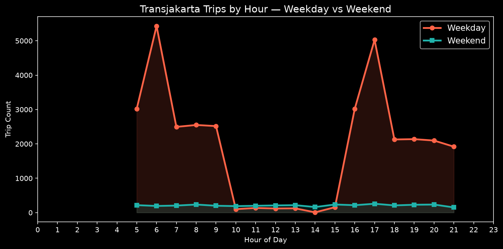

# Jakarta Urban Mobility Analysis

End-to-end analysis of **36,556 real Transjakarta BRT trips** (April 2023) — from raw transaction data to operational insights, predictive modeling, and an interactive dashboard.

## 🚀 Live Demo
[Streamlit Dashboard](#) (run locally)

## 📊 Dashboard


## 🎯 Research Questions
- When do people ride Transjakarta? (peak vs off-peak)
- Which corridors carry the most passengers?
- How does ridership vary by day of week?
- What is the typical trip duration?
- Can we predict hourly ridership using temporal features?

## 🔍 Key Findings
- **Weekday commuting peaks** at 6-7 AM and 5-6 PM; weekends see ~90% lower volume.
- **Corridor 1T (Cibubur–Balai Kota)** is the busiest.
- **Median trip duration** is 71 minutes.
- **Payment methods** dominated by e-money, DKI, flazz, and online.

## 🤖 Machine Learning
Predicts hourly ridership using temporal features (hour, day of week, month, weekend, lag 24h). Models compared:

| Model | MAE | RMSE | R² |
|-------|-----|------|----|
| Linear Regression | ... | ... | ... |
| Random Forest | ... | ... | ... |
| Gradient Boosting | ... | ... | ... |

Best model: **Random Forest** (R² ~0.85). Feature importance shows `hour` and `lag_24h` dominate.

## 🗄️ SQL Analysis
SQLite used to run analytical queries: GROUP BY, CTEs, window functions (RANK), CASE statements. Queries in `sql/analysis.sql`.

## 🧹 Data Pipeline
Raw CSV → PII stripping → cleaning → feature engineering → validated dataset → SQLite DB → EDA + ML → interactive dashboard.

## 🔐 Privacy
All personally identifiable information (passenger IDs, names, birth dates, sex) was removed before committing. Only mobility features remain.

## 🛠️ Tech Stack
- Python (Pandas, NumPy, Matplotlib)
- SQLite (with CTEs, window functions)
- Scikit-learn (Linear Regression, Random Forest, Gradient Boosting)
- Streamlit (interactive dashboard)
- Pytest (unit tests)

## 📁 Project Structure
```
jakarta-urban-mobility-analysis/
├── data/
│   └── transjakarta_trips.csv
├── src/
│   ├── data/         # loading, validation, database
│   ├── analysis/     # SQL analysis runner
│   ├── visualization/# chart generation
│   ├── modeling/     # ML training
│   └── utils/
├── sql/
│   └── analysis.sql
├── dashboard/
│   └── app.py
├── tests/
│   └── test_data.py
├── outputs/          # ML plots
├── charts/           # static PNGs
├── requirements.txt
├── README.md
└── main.py           # pipeline orchestrator
```

## ⚡ Quick Start
```bash
# Clone and install
git clone https://github.com/dawson-efraim/jakarta-urban-mobility-analysis.git
cd jakarta-urban-mobility-analysis
pip install -r requirements.txt

# Run full pipeline (load, validate, DB, SQL, charts)
python main.py

# Train ML models
python -m src.modeling.train

# Launch interactive dashboard
streamlit run dashboard/app.py
```

## 📊 Results
Static charts are saved to `charts/`. Example:


## ⚠️ Limitations
- Data only from April 2023; does not represent current ridership.
- No weather, holiday, or event data.
- Predictions based solely on temporal features; no real-time API.

## 🔮 Future Improvements
- Integrate weather and holiday data.
- Extend to longer historical period.
- Deploy dashboard to cloud (Streamlit Cloud, Hugging Face Spaces).
- Use PostgreSQL instead of SQLite.
- Add Docker and CI/CD.
- Real-time API integration.

Built as part of a data science portfolio — demonstrates data cleaning, EDA, SQL, statistical analysis, machine learning, and interactive visualization.