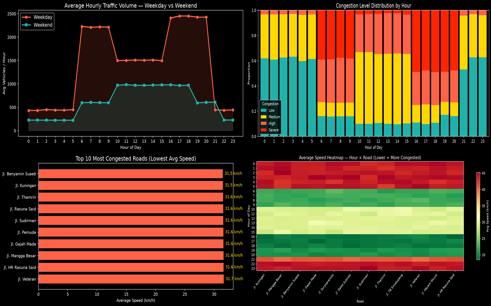

<h1 align="center">🚗 Jakarta Urban Mobility Analysis</h1>

<p align="center">
  
  
  
  
</p>

<p align="center">
  End-to-end analysis of <b>65,000+ traffic records</b> across Jakarta's major corridors — from raw time-series data to interactive visualizations and congestion insights.
</p>

---

## 📊 Dashboard

<p align="center">
  
</p>

The dashboard above visualizes key congestion patterns across **15 major roads** and **13 districts** (Jan–Jun 2024):

| Panel | Insight |
|-------|---------|
| **Hourly Volume** | Weekday traffic peaks at 6–9 AM and 4–8 PM rush hours; weekends flat and low |
| **Congestion by Hour** | Severe congestion concentrated during morning and evening rush (6–9 AM, 4–8 PM) |
| **Worst Roads** | Jl. Benyamin Suaeb and Jl. Pangeran Jayakarta are the most congested corridors |
| **Speed Heatmap** | Rush-hour speeds drop below 15 km/h on key arteries like Sudirman, Thamrin, and TB Simatupang |

---

## 🗂 Project Structure

```
jakarta-urban-mobility-analysis/
├── jakarta_traffic_data.csv       # 65K+ synthetic records (Jakarta traffic patterns)
├── data_loader.py                 # Load, clean & feature engineering
├── charts.py                      # 7 visualization functions
├── main.py                        # Pipeline orchestrator + summary stats
├── output/
│   └── dashboard.png              # README showcase dashboard (2×2 grid)
├── charts/                        # Generated PNG charts
│   ├── hourly_volume.png
│   ├── congestion_by_hour.png
│   ├── worst_roads.png
│   ├── monthly_trend.png
│   ├── weather_impact.png
│   ├── vehicle_mix.png
│   └── congestion_heatmap.png
├── requirements.txt
└── README.md
```

---

## ⚡ Quick Start

```bash
# Clone
git clone https://github.com/dawson-efraim/jakarta-urban-mobility-analysis.git
cd jakarta-urban-mobility-analysis

# Install
pip install -r requirements.txt

# Run analysis
python main.py
```

Charts are saved to `charts/` as PNGs. Summary statistics print to console.

---

## 🔧 Features

- **Realistic synthetic data** — 65K+ hourly records across 15 Jakarta roads, 13 districts, 6 months, with realistic rush-hour and weather patterns
- **7 visualization types** — Line charts, stacked bars, horizontal bars, pie charts, heatmaps, dual-axis plots
- **Dark theme styling** — Teal/coral/gold palette on dark background
- **OOP-ready architecture** — Clean separation: loader → charts → orchestrator
- **Zero dependencies on external APIs** — Dataset bundled in repo, runs with one command

---

## 📈 Questions Answered

| # | Question | Chart |
|---|----------|-------|
| 1 | How does traffic volume differ between weekday and weekend? | `hourly_volume.png` |
| 2 | When is congestion worst throughout the day? | `congestion_by_hour.png` |
| 3 | Which roads are the most congested? | `worst_roads.png` |
| 4 | How does traffic volume and speed trend month to month? | `monthly_trend.png` |
| 5 | How does weather affect traffic speed? | `weather_impact.png` |
| 6 | What's the vehicle type distribution across Jakarta? | `vehicle_mix.png` |
| 7 | What does rush-hour speed look like across different roads? | `congestion_heatmap.png` |

---

## 🛠 Tech Stack

- **Python 3.10+**
- **Pandas** — Data manipulation, groupby, pivot tables, crosstabs
- **Matplotlib / Seaborn** — Visualization with dark theme, heatmaps, dual-axis
- **NumPy** — Numerical operations

---

## 📂 Dataset

| Source | Description |
|--------|-------------|
| Synthetic (bundled) | 65,175 hourly traffic records across Jakarta's major roads — motorcycles, cars, buses, trucks, speed, congestion, weather (Jan–Jun 2024) |

Dataset mirrors real Jakarta traffic patterns: motorcycle dominance (~60%), morning/evening rush hours, rain-induced slowdowns, and weekday vs weekend differences.

---

<p align="center">
  <i>Built as part of a data science learning journey.</i><br>
  <sub>Raw traffic data → Clean analysis → Polished insights</sub>
</p>
